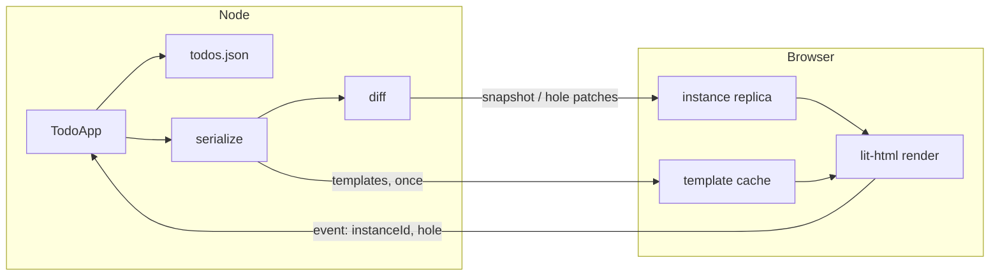

# Socklit

A server-authoritative UI runtime. You write components next to your data.
The browser is a replica: it paints the templates it is given and sends
clicks back as addresses. There is no REST handler for a button.

```ts
html`<button @click=${() => store.remove(todo.id)}>Delete</button>`
```

**New app.** Copy `starter/`, point `"socklit"` at this repo (`file:`),
`npm install && npm run dev`, open <http://localhost:5173>. One origin.
Guide: [`docs/getting-started.md`](docs/getting-started.md). Docs site:
`cd site && npm run dev`, then the `Local:` URL Vite prints.

**This repo.** `npm install && npm run dev` is still the research lab
(probes, protocol panel, two ports). That is not the product path.

## The idea in one paragraph

Treat a web app like an authoritative multiplayer simulation whose replicated
world is a UI tree. `lit-html` templates are the vocabulary. Each template's
static layout crosses the wire **once**; after that, only the values in its
holes are replicated. Events travel upward as an address (`instanceId` plus hole
index) rather than as an HTTP call, so a button is effectively a
network-addressable server closure.

## Running it

Two processes, because the client is served by Vite in development:

```bash
npm install
npm run dev
```

- Client: printed by Vite, usually <http://localhost:5173> (it shifts if the
  port is taken)
- Protocol: `ws://localhost:8787`, health check at <http://localhost:8787/health>

Override with `PORT` (server) and `?ws=ws://host:port` (client query string).
Data lives in [`data/todos.json`](data/todos.json); point elsewhere with
`TODOS_FILE`.

```bash
npm test        # unit and integration tests
npm run typecheck
```

## Documentation

- [`docs/getting-started.md`](docs/getting-started.md) — first app: `starter/`,
  `socklit/server`, `listen()`. The product path.
- [`docs/building-a-todo-app.md`](docs/building-a-todo-app.md) — a guided build.
  The most ordinary application possible, built with local component state, then
  persisted, then made multi-user, with each step turning out to cost less than
  the last. Ends by explaining what the first line of it was actually doing, then
  settles up with LiveView and pays the latency bill.
- [`docs/demo.md`](docs/demo.md) — the same story told from the wire inward:
  familiar-looking component code, then the frames and the closure table
  underneath. Every byte count in it was measured.
- [`docs/coming-from-react.md`](docs/coming-from-react.md) — the API surface for
  React developers: what carries over unchanged, what `useState` costs here,
  why there is no `useEffect`, and the lit-html rules that have no React
  analogue.

## What to look at

Open two browser tabs side by side and watch the Protocol panel.

- The first connection receives `templates` followed by `snapshot`.
- Toggling a todo produces `update [set, ...]` of a few hundred bytes with no
  HTML in it. Layout is never re-sent.
- A mutation in one tab appears in the other, because both sessions read the
  same store and re-render.
- A branch of UI that has never been rendered for a session, such as the
  "Clear completed" button, ships its template the first time it appears.
- Typing in the add field is untouched by unrelated renders: the draft is
  client-owned and only its submitted value is sent.

## Simulating latency

Localhost hides the central cost of this design: an interaction whose meaning
lives on the server cannot resolve until a round trip completes. The Latency
control in the Protocol panel inserts a delay on both hops, and the panel
reports what the last action actually felt like.

The setting is per tab, persists in `localStorage`, and can be set by query
string so two tabs can be compared side by side:

```
http://localhost:5182/?latency=400        # 400 ms round trip
http://localhost:5182/?latency=150&jitter=1
```

Delayed frames are queued in order rather than on independent timers, because
patches apply positionally against the replica and reordering would corrupt it.
At 0 ms the link is fully bypassed, so the undelayed path stays untouched.

What becomes obvious once latency is on: server-owned interactions cost the full
round trip. Toggling a todo at 400 ms takes ~400 ms to visibly settle, while
typing in the add field stays instant because that draft is client-owned. This
is the line the prototype exists to explore, and latency is what makes it
legible.

Turning the dial on also found a real bug, which is the argument for leaving it
on while developing. The event guard originally required an event to cite the
session's current revision, so any two interactions performed within one round
trip carried the same revision, and the second was discarded as `stale_event`.
The user's click silently vanished. The window for losing input is exactly one
round trip: at 0 ms it is about two milliseconds and unreachable by hand, at
400 ms ordinary clicking hits it constantly. See Event validity below for how
this was fixed.

## How it fits together



| File | Role |
| --- | --- |
| [`shared/protocol.ts`](shared/protocol.ts) | Wire types and inbound validation |
| [`server/serialize.ts`](server/serialize.ts) | Template interning, instance addressing, handler extraction |
| [`server/diff.ts`](server/diff.ts) | Two instance trees to patch operations |
| [`server/runtime.ts`](server/runtime.ts) | Sessions, revisions, event routing, broadcast |
| [`server/store.ts`](server/store.ts) | The whole backend: a JSON file behind a mutex |
| [`server/app/todo-app.ts`](server/app/todo-app.ts) | The application |
| [`client/runtime.ts`](client/runtime.ts) | Template cache, replica, rehydration, dispatch |

### Instance addressing

Instance ids are structural, not counters, so the same address means the same
place in the UI across renders:

```
root                          the root template
root/h1                       nested template in hole 1
root/h1/h0/k:<todo-id>        keyed row inside a list
```

Keys seed the address, which is why a row keeps its DOM state and its server
event routing when siblings are inserted or deleted. Collections must go
through `keyed(items, keyOf, render)`; a plain array is rejected so positional
identity is never accidental.

### Event validity

An event is valid if the handler it addresses still exists in the session's
committed table. There is deliberately no check that the browser is on the
current revision.

The reason is that a session-wide revision cannot distinguish "you acted on
something that has since changed" from "something unrelated changed while your
click was in flight," and the second case is normal at any real latency. Since
the socket and the per-session queue already guarantee events are applied in
the order the user performed them, and handlers close over freshly read state,
the address alone is enough: it names the exact node and hole, and for keyed
content it carries the record's own id.

The revision is still sent, and is used to classify a miss. If the address has
no handler and the browser was behind, it acted on a control that has since
disappeared, so it gets a recoverable `stale_event` and a fresh snapshot. If it
claims to be current, the address was never real and the message is treated as
hostile via `bad_event`.

This shifts a burden onto handlers: they must express intent, not a delta.
`setDone(id, true)` is safe to apply late, twice, or concurrently, whereas
`toggle(id)` means two clients both asking for "done" cancel out. The store
offers both; interaction handlers should use the absolute form.

### Authoring vocabulary

A hole may be a string, number, boolean, `null`, a nested `html` template, a
`keyed()` list, or an event handler. Anything else is rejected with a message
naming the instance and hole. Not supported in this prototype: `unsafeHTML`,
directives, dynamic tag names, spread attributes, `svg`/`mathml` templates.

Use `.checked=${todo.done}` rather than `?checked=`. The attribute only sets a
checkbox's initial state, so it cannot correct a box the user already clicked;
the property can.

## Deliberate limits

Not solved here, and not pretended to be: pagination, virtualization, interest
management, optimistic UI, offline behavior, session resume or migration,
authentication, SEO, and horizontal scaling. Sessions live in one process and
are dropped on disconnect; only the JSON file survives.

Latency is real. Every interaction routed to the server costs a round trip,
which is why the draft text field is deliberately client-owned. A production
version of this idea would need a much larger set of client-owned primitives.

Interest management is absent, so every session re-renders on every change.
That is fine for one list and would not be for a large one.

## Probes

The server hosts several applications at once, each a *probe*: a contrived app
built to force one architectural decision rather than to be useful. Probes are
discovered from disk, so adding one requires no registration.

```bash
npm run dev
# then pick a probe, and optionally simulate a round trip
open http://localhost:5182/?probe=todo
open http://localhost:5182/?probe=ledger&latency=400
```

| Endpoint | Purpose |
| --- | --- |
| `GET /probes` | Available probes, and which decisions each one forces |
| `GET /metrics` | Per probe: µs/node for render plus diff, retained bytes per session, bytes sent by message kind |
| `GET /health` | Liveness and session counts |

```bash
npm run bench          # render + diff cost, measured after warm-up
```

See [`server/probes/README.md`](server/probes/README.md) to write one, and
[`research/probes/`](research/probes/) for the findings each has produced.

## Research

Six companion documents, all written against this prototype rather than in the
abstract. **Start with the proposal** if you want the conclusions without the
working.

- [`research/proposal.md`](research/proposal.md) is the executive summary: what
  the architecture is, the changes that would take it from a working prototype to
  something deployable, and sketches of what each one looks like to write
  against. It assumes no prior context and does not discuss how any of it was
  arrived at. Four items in it have since been built and are marked as such: the
  component and hooks layer, key events and focus, handlers receiving the acting
  session, and read-scoped invalidation.
- [`research/tech-debt.md`](research/tech-debt.md) is the other side of that
  ledger: the shortcuts taken to ship those items, what each one costs, and the
  specific event that makes each one wrong. Most are fine indefinitely; two
  become incorrect the moment cross-session render sharing is built, and one
  rests on a convention that fails by going quietly stale rather than by
  erroring. It also records the one item that measured as less valuable than
  proposed: read scoping saves nothing in any probe yet, because every probe
  declares its store reads at the root of its tree, where nothing can be scoped
  out.
- [`research/economics.md`](research/economics.md) models cost and latency across
  six workloads and five architectures. Short version: the cost premise in the
  usual pitch is backwards, fan-out is the real constraint and it inverts above
  ~1000 viewers of a shared subtree, and the latency tax is 6-15 ms rather than
  the order of magnitude usually assumed. The inversion is capped by how much of
  that subtree is per-session, which turns out to matter more than audience size.
- [`research/design-probes.md`](research/design-probes.md) is a register of the
  architecture's open decisions, and a set of contrived applications chosen to
  force each one. It states which constraints are candidates to hold as
  invariants and which affordances would weaken them. Six of those applications
  are now built and measured, and the register carries their verdicts: the unit of
  sharing has to be the subtree and the thing blocking it is that handlers close
  over their session; dependency tracking should not be built; the client
  primitive library is one primitive and it is a correctness fix rather than an
  optimization; and what fragments render sharing is personalization, not
  authorization. Two probes falsified the reasoning that commissioned them.
- [`research/prior-art.md`](research/prior-art.md) surveys the systems that got
  here first. Phoenix LiveView independently arrived at nearly this exact wire
  format seven years earlier and has already answered several of the open
  questions above; htmx deletes the same API ceremony with no server state at
  all. Its conclusion is that the architecture is thoroughly explored but every
  mature implementation is trapped inside Elixir, C#, PHP, or Java — so the gap
  worth aiming at is this model in TypeScript, where a handler can capture the
  row itself rather than plumb an id, plus the one claim nobody has tested,
  cross-session render sharing.
- [`research/positioning.md`](research/positioning.md) asks how those systems
  sold themselves and whether the market bought it. Six patterns hold across
  twenty years, and they converge with the cost model on one decision: this
  should mount and own a *subtree* inside an app you already have, rather than
  own the page. That single change addresses the adoption risk, the SEO
  problem, and the personalization ceiling at once.

## Trust notes

The event channel treats the browser as untrusted: message shape, size,
revision, instance id, hole index, and payload are all validated, and only a
handler present in the currently committed table can run. Rendering a control
is not authorization, so handlers re-check their own preconditions against the
store.

Template strings are the exception: they are server-authored markup, equivalent
to shipping JavaScript, and the client reconstructs them as trusted layout.
Application *values* remain ordinary lit-html bindings and are escaped.
