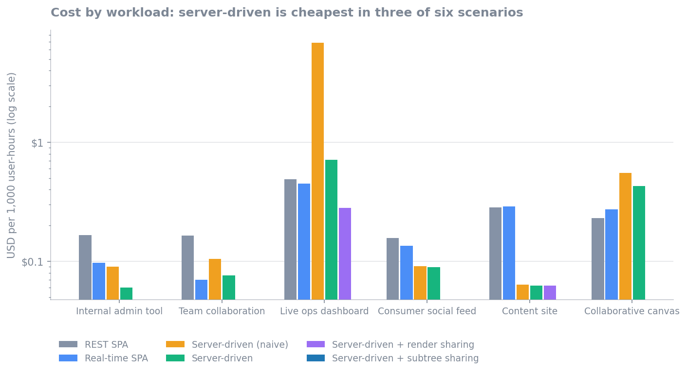
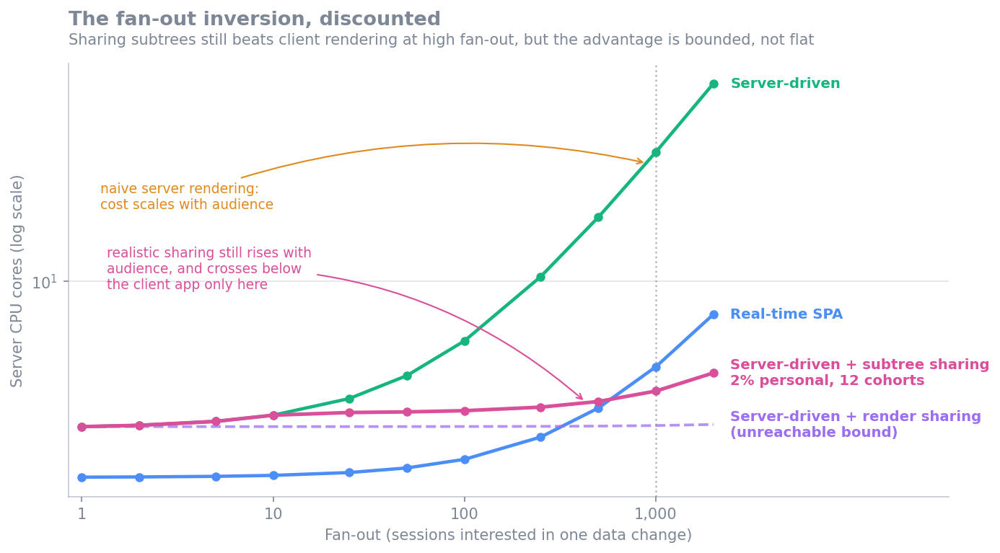
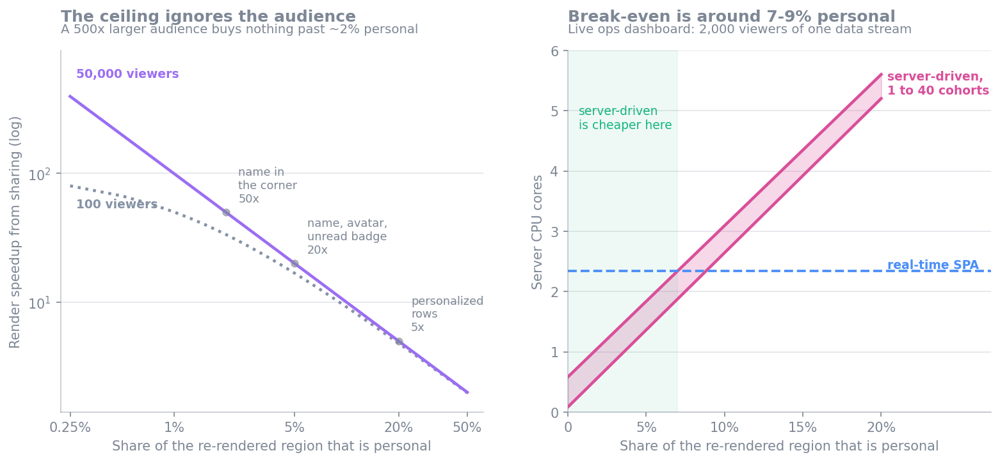
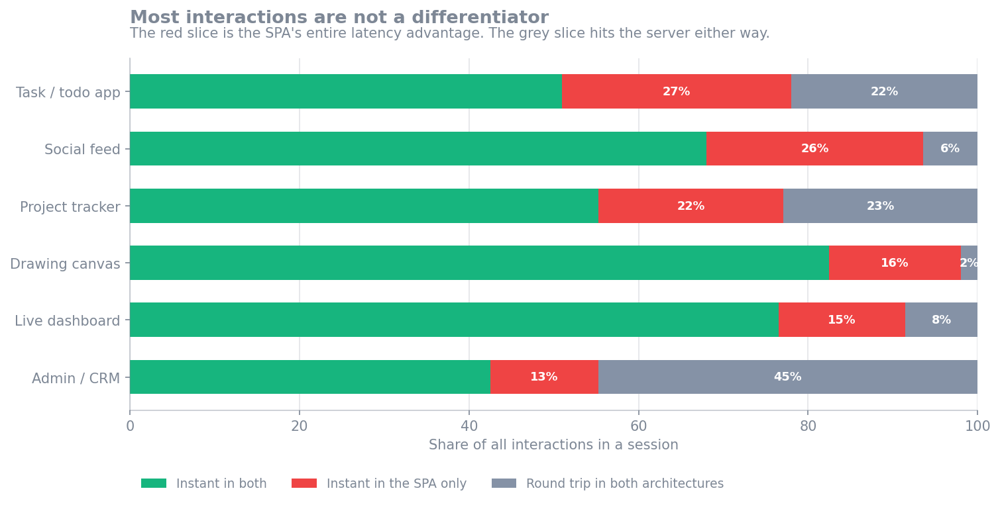
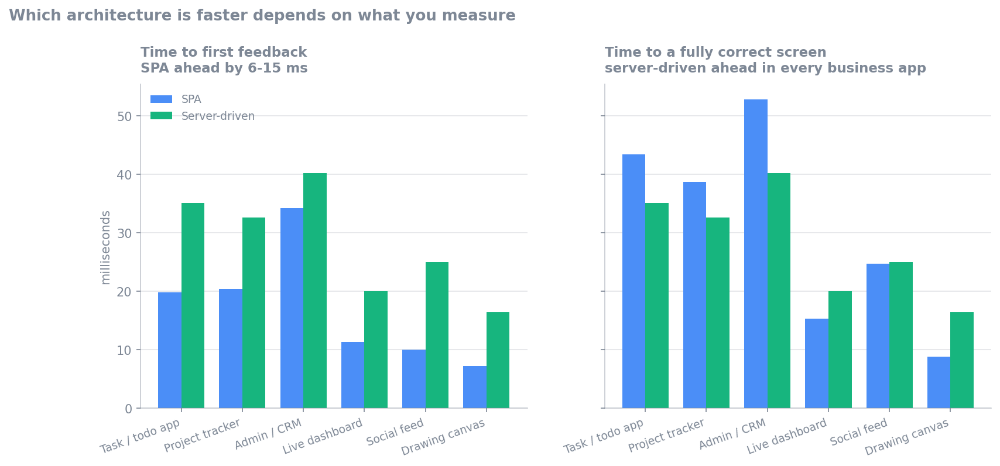
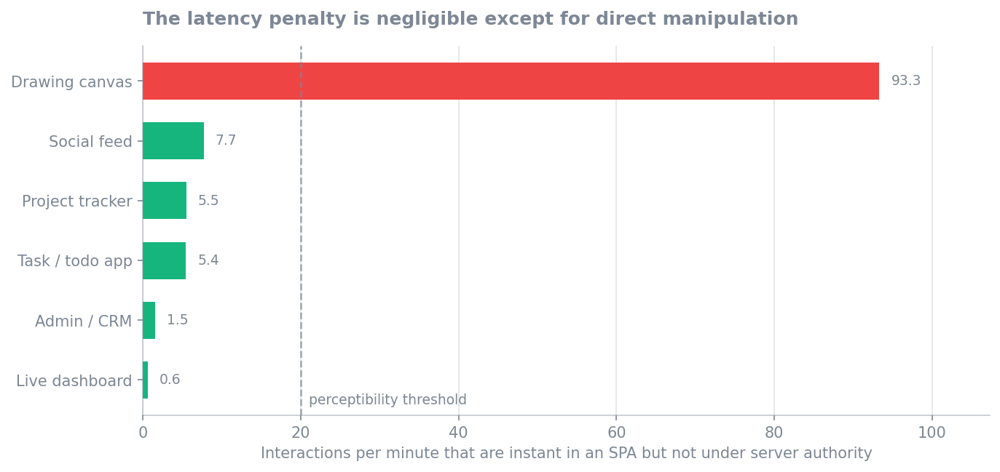
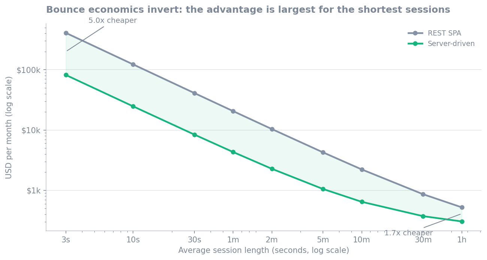

# Where server-driven UI actually wins

An investigation into one sentence from the README:

> The bet is not that this is cheaper. It moves rendering and reconciliation onto hardware you pay for, per user. The bet is that it collapses an entire category of accidental complexity [...] and that trading machine cost for human cost is often a good trade.

That sentence is confidently wrong in its premise and roughly right in its conclusion, for the wrong reason. Modeling it produced five results I did not expect.

All numbers come from [`cost_model.py`](cost_model.py), [`latency_model.py`](latency_model.py), and [`sharing_model.py`](sharing_model.py). Every constant is an assumption stated at the top of those files; re-run them with different constants to test any claim here. Charts are generated from the same models by [`make_charts.py`](make_charts.py), so they cannot drift from the numbers. Treat the ratios as meaningful and the absolute dollars as illustrative.

---

## Summary of findings

1. **The cost premise is backwards.** Server-driven UI is the *cheapest* option in three of six scenarios and competitive in a fourth. The intuition that you are "moving compute into your datacenter" overweights CPU and ignores that the dominant cost in a client-heavy architecture is shipping a 300 KB bundle to every visitor.

2. **Memory is not the constraint.** A million concurrent sessions cost about 210 GB, or $766/month in RAM. The thing everyone worries about first is an engineering problem, not an economic one.

3. **Fan-out is the constraint, and it inverts — but only so far.** Naive server-driven rendering costs 9x more CPU than a real-time SPA at fan-out 2000. Sharing renders across viewers inverts that, because a client architecture cannot amortize rendering across users at any price. But sharing has to be judged at the *subtree*, since no two sessions render an identical tree, and that caps the speedup at `1 / personal_share` regardless of audience size. Realistically the workload costs **a little over half** the SPA rather than the one third an idealized whole-session model claims, and the advantage disappears entirely above ~8% personal content.

4. **The latency tax is far smaller than a naive comparison suggests, and sometimes negative.** Most mutations hit the server in both architectures, so the round trip is not a differentiator. Measured against a realistic SPA, the gap in time-to-first-feedback is 6-15 ms, not 6 ms versus 70 ms — and on time-to-a-*correct*-UI, server authority is faster in three of six workloads. See finding 4, which corrects an earlier version of this document.

5. **Bounce economics invert too.** Conventional wisdom says per-session servers are terrible for high-bounce traffic. The model says server-driven wins by 5x at three-second sessions, because the bundle is a fixed toll per visitor while a three-second session is nearly free.

---

## Dimensions measured

Ten quantitative and four qualitative axes. The quantitative ones are computed per scenario per architecture.

| Dimension | Why it matters |
| --- | --- |
| DB read QPS | Usually the scarcest, least elastic resource |
| DB write QPS | Identical across architectures; a control |
| Server CPU cores | The cost the "moving compute to our datacenter" worry is about |
| Server memory GB | The cost everyone worries about first |
| Egress Mb/s | Usually ignored, frequently dominant |
| Client CPU ms/min | Compute you get for free, billed to the user's battery |
| Client CPU on low-end device | Same, at the p99 of your device distribution |
| Time to interactive | First-load experience |
| Interaction latency p50 / worst case | The thing users actually feel |
| Inbound events/s | Load the server cannot shed |
| Burst fan-out time | How long one change takes to reach everyone |
| Monthly USD, and USD per 1000 user-hours | Normalized cost |

Qualitative, tracked but not priced:

- **State locations** — how many places the same fact is stored. Classic SPA: 4 (database, server cache, client cache, component state). Real-time SPA: 5 (plus subscription state). Server-driven: 1. This is the human-complexity axis the README is really about.
- **Blast radius** — a deploy or crash destroys N live sessions rather than zero.
- **Offline capability** — client-heavy degrades; server-driven stops.
- **Data exposure** — the client physically never receives what the server did not render.

## Architectures compared

Comparing against a strawman SPA would be easy and useless, so both baselines are modeled generously:

- **`rest_spa`** — classic SPA. Delta-only polling (not full refetch), an 80% read-through cache, optimistic mutations.
- **`rt_spa`** — the above plus a WebSocket push layer. One query per change, fanned out to subscribers. This is the well-built modern app and the hardest baseline to beat.
- **`sdui_naive`** — server-driven UI where each invalidated session re-runs its own queries.
- **`sdui`** — server-driven UI with a shared query layer that dedupes reads.
- **`sdui_amort`** — adds render sharing for sessions viewing identical content. Retained only as an upper bound; finding 3 explains why it is not reachable.
- **`sdui_subtree`** — render sharing at subtree granularity, discounted for per-session content and for cohort partitioning. This is the honest server-driven number.

Both SPA baselines get optimistic UI, which turns out to be the crux (see finding 4). Server-driven pays a penalty for stateful capacity planning: 50% target utilization versus 70%, since sessions cannot be shed quickly and need migration headroom.

---

## Scenario results

Columns: DB reads/s, CPU cores, memory GB, egress Mb/s, client ms/min (mid-range), client ms/min (low-end), time-to-interactive ms, average action latency ms, inbound events/s, worst-case fan-out seconds, USD/month, USD per 1000 user-hours.

### Internal admin tool

200 concurrent, fan-out 20, 30 changes/min, 400 nodes, 50% local actions.

| arch | db r/s | cores | mem | egress | cli | low-end | TTI | act | ev/s | burst | $/mo | $/1k uh |
| --- | --- | --- | --- | --- | --- | --- | --- | --- | --- | --- | --- | --- |
| rest_spa | 4.0 | 0.07 | 0.001 | 0.33 | 6.5 | 26 | 931 | 6.0 | 33 | 0 | 24 | 0.17 |
| rt_spa | 0.54 | 0.06 | 0.01 | 0.04 | 3.6 | 14 | 931 | 6.0 | 13 | 0.001 | 14 | 0.10 |
| sdui_naive | 10 | 0.12 | 0.03 | 0.02 | 1.7 | 6.9 | 85 | 42 | 15 | 0.006 | 13 | 0.09 |
| **sdui** | 0.54 | 0.10 | 0.03 | 0.02 | 1.7 | 6.9 | **85** | 42 | 15 | 0.006 | **8.8** | **0.06** |

Server-driven is cheapest, has 11x better time-to-interactive, and uses a quarter of the client CPU. It pays 42 ms average action latency against 6 ms. At this scale every option is affordable, so the decision is entirely about developer experience and latency — which is exactly the trade the README claims.

### Team collaboration (Linear-like)

5,000 concurrent, fan-out 8, 2,000 changes/min, 600 nodes, 60% local.

| arch | db r/s | cores | mem | egress | cli | low-end | TTI | act | ev/s | burst | $/mo | $/1k uh |
| --- | --- | --- | --- | --- | --- | --- | --- | --- | --- | --- | --- | --- |
| rest_spa | 67 | 2.0 | 0.02 | 12 | 12 | 49 | 931 | 6.0 | 733 | 0 | 597 | 0.16 |
| **rt_spa** | 34 | 1.9 | 0.29 | 0.91 | 7.6 | 31 | 931 | 6.0 | 400 | 0 | **254** | **0.07** |
| sdui_naive | 267 | 3.7 | 1.0 | 0.70 | 3.1 | 12 | 86 | 37 | 490 | 0.004 | 383 | 0.11 |
| sdui | 34 | 3.2 | 1.0 | 0.70 | 3.1 | 12 | 86 | 37 | 490 | 0.004 | 278 | 0.08 |

Essentially a tie on cost (within 10%), with server-driven using 1.7x the CPU and 3.4x the memory but a fifth of the egress. Note that `sdui_naive` costs 8x the database load of `sdui` — same architecture, one design decision apart.

### Live ops dashboard

2,000 concurrent, fan-out 2,000, 600 changes/min, 800 nodes, 70% local. Everyone watches the same data.

| arch | db r/s | cores | mem | egress | cli | low-end | TTI | act | ev/s | burst | $/mo | $/1k uh |
| --- | --- | --- | --- | --- | --- | --- | --- | --- | --- | --- | --- | --- |
| rest_spa | 80 | 0.27 | 0.008 | 23 | 29 | 117 | 931 | 6.0 | 405 | 0 | 714 | 0.49 |
| rt_spa | 10 | 2.3 | 0.11 | 20 | 288 | **1,200** | 931 | 6.0 | 5.0 | 0.16 | 654 | 0.45 |
| sdui_naive | **20,000** | 66 | 0.51 | 13 | 7.3 | 29 | 87 | 32 | 6.8 | 1.3 | 10,100 | 6.9 |
| sdui | 10 | 26 | 0.51 | 13 | 7.3 | 29 | 87 | 32 | 6.8 | 1.3 | 1,000 | 0.71 |
| **sdui_amort** | 10 | **0.09** | 0.51 | 13 | 7.3 | 29 | **87** | 32 | 6.8 | **0.001** | **408** | **0.28** |

This scenario contains the two most interesting numbers in the study.

`sdui_naive` hits **20,000 database reads per second** — 2,000x more than the deduped version — because each of 2,000 sessions re-runs its own query on every one of ten changes per second. This is the failure mode that makes people dismiss the architecture, and it is a property of one implementation choice, not of the architecture.

`sdui_amort` needs **0.09 cores** where the real-time SPA needs 2.3, a 25x improvement, because 2,000 users looking at the same dashboard is one render instead of 2,000. Meanwhile the SPA is burning 1.2 seconds of CPU per minute on a low-end phone — a 2% continuous duty cycle just to stay current, 40x what the server-driven client does.

### Consumer social feed

200,000 concurrent, fan-out 1.2, 200,000 changes/min, 500 nodes, 80% local.

| arch | db r/s | cores | mem | egress | cli | low-end | TTI | act | ev/s | burst | $/mo | $/1k uh |
| --- | --- | --- | --- | --- | --- | --- | --- | --- | --- | --- | --- | --- |
| rest_spa | 1,400 | 63 | 0.76 | 518 | 11 | 43 | 931 | 6.0 | 20,000 | 0 | 22,900 | 0.16 |
| rt_spa | 3,800 | 65 | 11 | 377 | 9.4 | 37 | 931 | 6.0 | 13,300 | 0 | 19,700 | 0.14 |
| **sdui** | 3,800 | 108 | 37 | **113** | 6.8 | 27 | **86** | 26 | 21,300 | 0 | **13,000** | **0.09** |

Counterintuitively the cheapest option, purely on egress: no 300 KB bundle, and patches instead of JSON payloads. But it needs 1.7x the CPU, 3.4x the memory, and must absorb 21,300 inbound events per second with no ability to shed load. Cost says yes; operational risk says no. **Being cheapest is not the same as being a good idea.**

### Content / marketing site

50,000 concurrent, 2-minute sessions, near-static content.

| arch | db r/s | cores | mem | egress | cli | low-end | TTI | act | ev/s | burst | $/mo | $/1k uh |
| --- | --- | --- | --- | --- | --- | --- | --- | --- | --- | --- | --- | --- |
| rest_spa | 83 | 1.7 | 0.19 | 344 | 1.1 | 4.3 | 931 | 6.0 | 333 | 0 | 10,400 | 0.28 |
| rt_spa | 417 | 2.2 | 2.9 | 344 | 1.1 | 4.4 | 931 | 6.0 | 333 | 1.5 | 10,500 | 0.29 |
| **sdui** | 417 | 3.5 | 6.9 | **63** | 1.5 | 6.1 | **85** | 21 | 783 | 12 | **2,300** | **0.06** |

A 4.5x cost advantage on the workload everyone agrees is the worst fit for this architecture. The entire difference is bundle egress. This does not mean you should build a marketing site this way — you should build it with static HTML, which beats all three — but it does mean "high bounce rate kills server-driven UI" is false as an economic claim.

Note the 12-second burst fan-out, though. Without render sharing, one content change takes 12 seconds to reach 50,000 sessions.

### Collaborative canvas

1,000 concurrent, 600 actions/min, 97% locally handleable.

| arch | db r/s | cores | mem | egress | cli | low-end | TTI | act | ev/s | burst | $/mo | $/1k uh |
| --- | --- | --- | --- | --- | --- | --- | --- | --- | --- | --- | --- | --- |
| **rest_spa** | 0.06 | 1.3 | 0.004 | 0.30 | 540 | 2,200 | 931 | 6.0 | 300 | 0 | **168** | **0.23** |
| rt_spa | 50 | 1.4 | 0.06 | 0.54 | 549 | 2,200 | 931 | 6.0 | 300 | 0.001 | 199 | 0.27 |
| sdui | 50 | 5.1 | 0.31 | 1.5 | 248 | 990 | 87 | 17 | **1,800** | 0.004 | 312 | 0.43 |

The clear loss, and the cost difference understates it. Even at 85% client-primitive coverage, 1,800 events per second reach the server, and every one of the 15% of pointer interactions without a primitive stutters at 70 ms. The average latency figure of 17 ms is misleading — see finding 4.

---

## The findings in detail

### 1. The cost premise is backwards

Ranked by cost per 1000 user-hours, server-driven UI is cheapest in three of six scenarios (admin, feed, content), within 15% in a fourth (collaboration), best-or-worst depending on one implementation decision in the fifth (dashboard), and clearly worst in the sixth (canvas).

The reason is that the README's mental model — "client-heavy architectures exploit billions of dollars of user-owned compute" — is true about CPU and false about the delivery of the software that runs on it. A 300 KB bundle at 30% cache miss and $0.09/GB is a real per-visitor toll, and at typical prices bandwidth costs more than the compute it saves. Server CPU is remarkably cheap; egress is not.

This does not make the architecture free. It relocates the argument. **Money is not the reason to avoid this design, and money is not the reason to choose it either.**

### 2. Memory is an engineering problem, not an economic one

At 220 KB per session (600-node view, retained instance tree, handler closures, socket buffers):

| Sessions | Memory | RAM cost/month |
| --- | --- | --- |
| 10,000 | 2.1 GB | $8 |
| 100,000 | 21 GB | $77 |
| 1,000,000 | 210 GB | $766 |
| 10,000,000 | 2.1 TB | $7,658 |

A million concurrent sessions for the price of a laptop. That is 3.7x what a real-time SPA needs for its socket and subscription state, and the multiple is what matters, but the absolute number is small enough that memory should not drive the design.

The real constraints hiding inside that number are operational: 210 GB does not fit in one Node heap, so you need on the order of 50-100 processes with sticky routing, and GC pressure across a large retained object graph is a genuine risk that this model does not capture.

### 3. The fan-out inversion, and its ceiling

This is the most interesting result, and the one that needed the most correction. As fan-out grows, server CPU relative to a real-time SPA:

> **Now measured, and corrected again.** Three probes have since tested this finding directly. In brief: the render constant is nearly 10x cheaper than assumed, the penalty for not sharing is 1.20x rather than 9.11x, egress rather than CPU is the binding constraint, and the crossover is governed by personalization rather than by the constant. The `sdui` column below is therefore too expensive and the `sdui_amort` column too cheap. See [*Measured, in six probes*](#measured-in-six-probes) at the end of this document, and [`design-probes.md`](design-probes.md#s1-what-is-the-unit-of-replication-and-amortization) for the protocol work the amortized column assumes.

| Fan-out | rt_spa | sdui | sdui_amort (bound) | sdui_subtree | ratio |
| --- | --- | --- | --- | --- | --- |
| 1 | 1.54 | 2.49 | 2.49 | 2.49 | 1.62x |
| 10 | 1.56 | 2.78 | 2.49 | 2.78 | 1.78x |
| 50 | 1.68 | 4.06 | 2.49 | 2.87 | 1.71x |
| 100 | 1.82 | 5.66 | 2.50 | 2.90 | 1.59x |
| 250 | 2.26 | 10.47 | 2.50 | 3.00 | 1.33x |
| **500** | 2.98 | 18.47 | 2.51 | 3.17 | **1.06x** |
| 1000 | 4.42 | 34.49 | 2.52 | 3.50 | **0.79x** |
| 2000 | 7.30 | 66.51 | 2.55 | 4.17 | **0.57x** |

Without any sharing, cost scales linearly with fan-out and becomes indefensible: 9x the CPU of a client app at fan-out 2000. This is the "50,000 sessions wake up and re-render" problem, and it is real.

The underlying asymmetry is genuine. When 2,000 people look at the same dashboard, a client architecture performs 2,000 renders on 2,000 machines. It has no choice: the renders happen in 2,000 separate address spaces. A server that owns all 2,000 sessions can render once and send the result 2,000 times. **Client-side rendering cannot deduplicate identical work across users at any price, and server-side rendering can.**

That claim is about *client* rendering, and against the two SPA baselines it holds. It is not an argument against every alternative. A stateless server-rendered app can put an impersonal shared fragment behind a CDN and get the same amortization from decades-old infrastructure — free, geographically distributed, and with no stateful server to operate. The only difference is freshness: a cache TTL against an instant push. `cost_model.py` has no cached-server-HTML baseline and should grow one, because for several workloads here it is probably the cheapest option on the board. See [`prior-art.md`](prior-art.md#htmx).

But the `sdui_amort` column is an unreachable bound, not an operating point, and an earlier version of this document quoted it as the result. It assumes whole sessions render identically. **Sessions are never identical.** Two people on the same dashboard are on different routes, have different unread badges, a different name in the corner, and different permissions. Sharing has to be judged at the subtree, and that costs two separate discounts.

**Discount one: Amdahl.** The personal part of the re-rendered region is rendered per session no matter how large the audience gets, so speedup is capped at `1 / personal_share`. The cap is a property of the view, not of the audience — a 500x larger audience does not move it.

| Personal share of the re-rendered region | Speedup ceiling |
| --- | --- |
| 0.5% — a clock, a connection dot | 200x |
| 2% — name in the corner | 50x |
| 5% — name, avatar, unread badge | 20x |
| 20% — personalized rows inside a shared table | 5x |

**Discount two: partitioning.** The shared part is only shared within a cohort whose inputs *and* authorization match, so the audience splits into `distinct_views x auth_classes` cohorts. An admin console with 4 saved views and 10 roles is 40 cohorts, which takes 2%-personal sharing from 49x down to 25x.

Of the two, Amdahl dominates. The band between 1 and 40 cohorts in the chart above is narrow next to the slope: **how personal the view is matters far more than how finely the audience partitions.**

Applying both to the live ops dashboard (2,000 viewers, one data stream), server-driven stays cheaper than a real-time SPA only below **7-9% personal content**. That is a real advantage and it is still structural, but it is a factor of two or three, not the 3x-and-growing the original number implied.

**Where the personal value sits matters more than how big it is.** A single "assigned to you" cell is small, but it sits inside the repeated row, so it personalizes a share of the tree proportional to the row count. Modeled as a subtree re-render it costs 9.13 cores against the SPA's 2.34 — a 3.9x loss, catastrophically worse than the naive case it was supposed to improve.

That failure points at the fix, and it is one the chosen IR is unusually well positioned for. The C2 template/instance model already separates structure from hole values. If a personal value is confined to a *hole*, the instance is built once per cohort and only the binding is evaluated per session:

| Cost of a personal value vs a full node render | Cores | vs SPA |
| --- | --- | --- |
| 100% — forces a subtree re-render | 9.13 | 3.90x |
| 25% — hole binding and compare | 2.41 | 1.03x |
| 5% — pure scalar substitution | 0.62 | 0.27x |

**This is a constraint on the authoring API, not an optimization.** For sharing to survive personalization, a personal value may parameterize a shared subtree but may not change its shape. An author who writes `${user.isAdmin ? html\`<td>...\`: nothing}` inside a list row has silently destroyed the amortization; an author who writes `<td>${user.badgeFor(row)}</td>` has not. Nothing in the current spec distinguishes these, and nothing warns the author. That is the sharpest open design question the model produces, and it is `design-probes.md` S1 and A6 restated as a number.

`sharing_model.py` derives all of the above.

**A caveat on the database claim.** Server-driven UI is often described as reducing database load, and it does — but only against clients that poll frequently. At 5,000 concurrent sessions:

| Poll interval | rest_spa reads/s | sdui reads/s | sdui_naive reads/s |
| --- | --- | --- | --- |
| 2s | 500 | 34 | 267 |
| 10s | 100 | 34 | 267 |
| 30s | 34 | 34 | 267 |
| 60s | 17 | 34 | 267 |
| 300s | 3.5 | 34 | 267 |

The crossover sits near a 30-second poll interval. Server-driven UI reads on every change, so its database load is set by how fast the data moves rather than by how many users are watching. For an app where 60-second staleness is acceptable, polling is cheaper. The advantage is real only when the product genuinely requires freshness — and against `sdui_naive`, polling wins at every interval on this workload.

**A caveat on the database claim.** Server-driven UI is often described as reducing database load, and it does — but only against clients that poll frequently. At 5,000 concurrent sessions:

| Poll interval | rest_spa reads/s | sdui reads/s | sdui_naive reads/s |
| --- | --- | --- | --- |
| 2s | 500 | 34 | 267 |
| 10s | 100 | 34 | 267 |
| 30s | 34 | 34 | 267 |
| 60s | 17 | 34 | 267 |
| 300s | 3.5 | 34 | 267 |

The crossover sits near a 30-second poll interval. Server-driven UI reads on every change, so its database load is set by how fast the data moves rather than by how many users are watching. For an app where 60-second staleness is acceptable, polling is cheaper. The advantage is real only when the product genuinely requires freshness — and against `sdui_naive`, polling wins at every interval on this workload.

### 4. Latency is a much smaller tax than it appears (corrected)

An earlier version of this document claimed the trade was 6 ms against 70 ms. That was wrong, because it credited the SPA with optimistic UI on *every* mutation. The correct question is the one a practitioner would ask: **when you click a button in a real app, are you not hitting the server anyway?** Mostly, yes. This section is modeled separately in [`latency_model.py`](latency_model.py).

The error was treating interactions as binary — local or remote. There are three classes:

**Ephemeral.** Hover, focus, scroll, typing, opening a menu. Instant in both architectures, assuming server-driven has a client primitive for it. No round trip either way.

**Predictable mutations.** Toggle done, star, like, reorder. The client can guess the outcome, so an SPA *may* paint instantly and reconcile later. This is the only class where the SPA has an inherent advantage.

**Unpredictable mutations.** Create a record with a server-generated id, submit a form with server validation, assign something subject to permissions, anything producing derived totals or conflict resolution. The client cannot know the answer. **Both architectures wait a full round trip.**

The red slice is the entire practical latency advantage of a client architecture. The grey slice is the round trip you pay regardless of where the application lives.

**The taxonomy is missing a state, and it changes what the red slice means.** This model, and [`latency_model.py`](latency_model.py) with it, treats a mutation as either predicted and instant or `unavoidable` — there is no third option in which the user receives *immediate evidence their input registered* without receiving a predicted value. That third option is an honest placeholder: a pending marker, a disabled control, a skeleton body, a nav highlight that moves on the click. It asserts nothing about the outcome, so unlike optimistic UI it is legal in every domain including contended ones, and it costs no round trip because it is client-local. It is now [A9 in the register](design-probes.md#a9-acknowledgment-affordances) and a probe is specified for it.

Two consequences. First, the red slice conflates two things a client app gets from running code on click — acknowledgment and prediction — and only the second is what server authority structurally cannot have. Second, and more awkwardly, **the red slice is not currently claimed by server-driven UI at all**: the [routes probe](probes/routes.md) measured navigation as a full round trip in which the active-link highlight does not move, no loading state appears, and nothing whatsoever acknowledges the click. So the gap this section measures is real but its *cause* is partly a missing affordance rather than an architectural necessity, and the affordance is cheap.

None of the numbers below change. What changes is the interpretation: they measure time to first *correct value*, which is the right thing to measure and is not the same as time to first feedback.

Two additional facts narrow the gap further. Optimistic updates must be hand-written per mutation, so coverage in real codebases is partial rather than universal. And a mutation typically invalidates queries, so an SPA often needs a *second* round trip before the UI is globally correct — the invalidate-then-refetch pattern that is the React Query default.

That second point matters more than it sounds, because it changes which architecture is measured as faster depending on what you measure. "First pixel moves" and "the screen is correct" are different events.

| Workload | SPA feedback | sdui feedback | gap | SPA consistent | sdui consistent | gap |
| --- | --- | --- | --- | --- | --- | --- |
| Task / todo app | 19.9 ms | 35.2 ms | +15.3 | 43.4 ms | 35.2 ms | **-8.3** |
| Project tracker | 20.4 ms | 32.6 ms | +12.2 | 38.8 ms | 32.6 ms | **-6.1** |
| Admin / CRM | 34.2 ms | 40.2 ms | +6.0 | 52.8 ms | 40.2 ms | **-12.6** |
| Live dashboard | 11.4 ms | 20.0 ms | +8.6 | 15.4 ms | 20.0 ms | +4.6 |
| Social feed | 10.0 ms | 25.0 ms | +15.0 | 24.7 ms | 25.0 ms | +0.3 |
| Drawing canvas | 7.3 ms | 16.4 ms | +9.2 | 8.8 ms | 16.4 ms | +7.6 |

"Consistent" means the whole view is correct, including the counters, badges, sidebar totals, and activity feeds that the mutation also affected. **Server authority is faster to a correct UI in the three business-application workloads**, because its patch is holistically correct by construction while the SPA's optimistic update is locally correct and globally stale until the refetch lands.

The crossover is where refetch probability passes about 50%:

| Refetch probability | SPA consistency | sdui consistency | Winner |
| --- | --- | --- | --- |
| 0% (mutation returns full state) | 25.9 ms | 32.6 ms | spa |
| 25% | 31.3 ms | 32.6 ms | spa |
| 50% | 36.6 ms | 32.6 ms | **sdui** |
| 75% | 42.0 ms | 32.6 ms | **sdui** |
| 100% | 47.3 ms | 32.6 ms | **sdui** |

An SPA avoids this only by having every mutation endpoint return everything the change touched, which is a real API design burden and precisely the ceremony this architecture removes.

**How often does the SPA's advantage actually apply?**

| Workload | Instant in SPA | Instant in sdui | SPA-only edge | Per minute |
| --- | --- | --- | --- | --- |
| Task / todo app | 78% | 51% | 27% | 5.4 |
| Project tracker | 77% | 55% | 22% | 5.5 |
| Admin / CRM | 55% | 42% | 13% | 1.5 |
| Live dashboard | 92% | 76% | 15% | 0.6 |
| Social feed | 94% | 68% | 26% | 7.7 |
| **Drawing canvas** | 98% | 82% | 16% | **93.3** |

In business applications the SPA is exclusively faster on 13-27% of interactions, amounting to roughly 1.5 to 5.5 noticeable events per minute. Meanwhile 22-45% of interactions in those same workloads hit the server under *both* architectures, where latency is identical and simply not a differentiator.

Percentages understate the canvas, though, because it produces so many more interactions per minute. Converting to absolute frequency is what separates the workloads:

**Optimistic UI can be a framework primitive rather than per-feature work.** Nothing prevents a server-authoritative runtime from echoing a predicted value locally while the round trip completes — declared at the binding rather than hand-written per mutation. Phoenix LiveView does a version of this. Modeling it at 80% coverage:

| Workload | SPA | sdui | sdui + optimistic primitive |
| --- | --- | --- | --- |
| Task / todo app | 19.9 ms | 35.2 ms | 20.9 ms |
| Project tracker | 20.4 ms | 32.6 ms | 22.2 ms |
| Admin / CRM | 34.2 ms | 40.2 ms | **33.1 ms** |
| Social feed | 10.0 ms | 25.0 ms | 16.9 ms |
| Drawing canvas | 7.3 ms | 16.4 ms | 15.5 ms |

Business applications land within 1-2 ms of the SPA, and the form-heavy one wins outright. The asymmetry worth noting is that the SPA's optimistic behavior is N hand-written implementations with N rollback paths, while this is one runtime feature with a declarative opt-in.

**Where the latency objection still holds.** The canvas: 93 interactions per minute that are instant in an SPA and not under server authority. When interaction is continuous rather than discrete, the round trip is the product, and no amount of framework cleverness fixes it. The distinction is not "how fast is a click" but **how many interactions per minute fall outside your primitive coverage** — a handful for business software, dozens per minute for direct manipulation.

### 5. Client-primitive coverage is the master variable

The fraction of interactions handled locally is not a property of the workload. It is a capability you build one primitive at a time, and it drives both latency and server load:

| Coverage | p50 latency | Events/s | Cores |
| --- | --- | --- | --- |
| 0% | 69.5 ms | 1,000 | 1.63 |
| 30% (v0) | 52.3 ms | 730 | 1.37 |
| 50% | 40.9 ms | 550 | 1.20 |
| 70% | 29.5 ms | 370 | 1.02 |
| 85% | 20.9 ms | 235 | 0.89 |
| 100% | 12.3 ms | 100 | 0.76 |

Every percentage point of coverage simultaneously improves latency and reduces server cost, which makes the client primitive library the highest-leverage work in the whole system. It is also the part that most resembles reinventing a client framework — the tension the original design conversation identified as central. Coverage is where "the client owns mechanics, the server owns meaning" stops being a slogan and becomes a backlog.

Read alongside finding 4, this is more encouraging than it looks. Coverage only has to span the *ephemeral* interactions — hover, focus, scroll, text entry, menus, drag affordances. That is a bounded and largely app-independent list, which is why it can live in the runtime. It does not have to cover mutations, because those hit the server in a client app too.

**Half confirmed, measured.** The [menu-heavy admin probe](probes/admin.md) inventoried a dense operations console against this claim. *Bounded and app-independent*: strongly yes, and better than stated — every ephemeral interaction in that UI collapses to **one** primitive, a client-owned boolean gating a subtree the server already rendered, which covers menus, dropdowns, popovers, tooltips, disclosure, accordions and modal visibility. Nothing about it is domain-specific and the browser half-implements it already as `
`. *Sufficient*: no. Full ephemeral coverage takes that screen from 34.5 to 20.4 uncovered interactions per minute, which is the decision rule's threshold rather than a comfortable margin under it, because sort, filter, tab switching and column visibility are not ephemeral and not mutations — they are the third class this finding does not name, where the client would have to hold the data to act locally. So the primitive library is necessary, is smaller than expected, and does not finish the job on its own; the rest is windowed collections.

Two corrections to the framing rather than the numbers. Coverage of text entry is not a latency optimization but a **correctness fix** — a server-owned input measurably drops characters when the user types faster than the round trip, producing `gryel` from `grayfell` at 150 ms. And *focus*, listed here as an ephemeral interaction, had no representation in the protocol in either direction, which made every menu and dialog the architecture could build mouse-only. Both directions now exist: inbound, a `key` payload carrying the logical key with its modifiers, and `focus`/`blur` payloads reporting that focus moved; outbound, a `focusWhen()` hole the client applies as a transition on the render where it becomes active, so that limit is no longer structural. It is also not yet exercised: key handlers bind to elements rather than to the document, so Escape reaches a menu only while that menu holds focus, and no probe has been rewritten to use either half, which is why the interaction counts above were all taken against the mouse-only version.

### 6. Bounce economics invert

50,000 concurrent visitors, varying session length:

| Session length | rest_spa | sdui | Winner |
| --- | --- | --- | --- |
| 3s | $408,499 | $81,911 | sdui by 5.0x |
| 10s | $122,677 | $24,739 | sdui by 5.0x |
| 30s | $41,014 | $8,405 | sdui by 4.9x |
| 2min | $10,390 | $2,279 | sdui by 4.6x |
| 10min | $2,224 | $646 | sdui by 3.4x |
| 1hr | $523 | $305 | sdui by 1.7x |

The advantage is *largest* for the shortest sessions and shrinks as sessions lengthen — the exact opposite of the intuition that per-session server state punishes bounce traffic. A three-second session costs almost nothing in server memory, while the bundle is a fixed toll collected from every visitor regardless of whether they stay.

The corollary is uncomfortable for the "highly stateful authenticated applications" targeting advice in the original design conversation: the *economic* case is strongest for short sessions, while the *experience* case is strongest for long ones.

### 7. Burst behavior is the hidden operational risk

Time to fan one change out to every interested session, without render sharing: 1.3 seconds for the dashboard, **12 seconds** for the content site. During that window the server is saturated and every other user's interactions queue behind it. Render sharing collapses both to roughly 1 ms.

Deploys are the other burst. Every session must be rebuilt from scratch:

| Population | Drain window | CPU spike | Egress spike |
| --- | --- | --- | --- |
| 100,000 x 600 nodes | 10s | 4.8 cores | 2.3 Gb/s |
| 100,000 x 600 nodes | 60s | 0.8 cores | 0.4 Gb/s |
| 1,000,000 x 600 nodes | 10s | 48 cores | 23 Gb/s |
| 1,000,000 x 600 nodes | 60s | 8.0 cores | 3.9 Gb/s |

Manageable, but only with deliberate staggering. A naive "restart the fleet" deploy at a million sessions means provisioning 48 cores and 23 Gb/s that sit idle the rest of the time. Client-heavy architectures have no equivalent event, since old clients keep running against the new backend.

---

## Where the architecture is optimal

Ranked by how structural the advantage is.

**1. High fan-out over views that are nearly impersonal.** Live dashboards, ops consoles, leaderboards, auction and market displays, event scoreboards, status pages. Render amortization makes the server-driven version genuinely cheaper than any client architecture, and it is the only category where the win is structural rather than incidental. The qualifier is load-bearing: the advantage requires the shared subtree to be under ~8% per-session content, which rules out most of these the moment someone adds a "your alerts" column to the row.

**2. Populations with weak devices.** The dashboard scenario has the real-time SPA burning 1.2 s/min of CPU on a low-end phone versus 29 ms for the server-driven client, a 40x difference, plus 11x better time-to-interactive. For emerging markets, kiosks, embedded displays, or any app where the p99 device is slow, this is a large user-experience win that costs the operator nothing.

**3. Data-sensitive internal tools.** The client physically cannot receive data the server did not render. Combined with the single state location, this is a meaningfully smaller audit surface. Small scale means the latency penalty falls on tolerant users and the cost differences are rounding errors.

**4. Apps that already need real-time.** If you were going to build a WebSocket layer, subscriptions, and fan-out anyway, the marginal cost of this architecture is small and it deletes the parallel REST path.

## Where the architecture is catastrophic

**1. Continuous pointer interaction.** Drawing, dragging, resizing, gaming. The canvas scenario costs 1.9x more and floods the server with 1,800 events/s, and the residual interactions without primitives feel broken. No amount of engineering fixes the round trip.

**2. Personalized data at massive scale.** The feed scenario is cheapest on paper and still a bad idea: fan-out of 1.2 means no amortization is possible, so you pay full render cost per user while absorbing 21,300 unsheddable inbound events per second.

**3. Anything needing offline.** Not modeled; losing the connection means losing the application.

**4. Direct manipulation of the thing on screen.** Not "latency-sensitive apps" generally — discrete clicks are fine, since they hit the server in both architectures. The problem is *continuous* interaction, where the interaction and the state change are the same gesture: dragging a shape, resizing a column, painting a stroke. The canvas mix produces 93 interactions per minute that an SPA makes instant and server authority does not.

---

## A decision rule

Two numbers predict most of the outcome.

**Uncovered interactions per minute** = `interactions_per_min x (fraction instant in an SPA but not under server authority)`

This is narrower than "round trips per minute," because interactions that hit the server in both architectures are not a differentiator. Business applications land at 1.5 to 5.5 per minute, which is negligible. The drawing canvas lands at 93, which is fatal. The threshold is somewhere around 20; below it, users do not perceive an architectural difference.

**"Uncovered" means two different things and the threshold probably only applies to one of them.** An interaction can be uncovered because the user gets *no acknowledgment* or because they get *no correct value*, and those are separately fixable — the first by [A9](design-probes.md#a9-acknowledgment-affordances) at no correctness cost, the second only by prediction or by moving data to the client. The distinction matters for what a high count implies: a claim, an approval or a navigation counts as uncovered today and would plausibly stop feeling that way with an acknowledgment alone, whereas opening a menu, sorting or filtering would not, because the user's purpose was to see content and a placeholder shows them nothing they wanted. Whether acknowledgment moves the perceived threshold is not knowable from this model and is the reason the claim queue probe is specified rather than assumed.

**The business-application estimate is too optimistic by more than a factor of ten, measured.** The [menu-heavy admin probe](probes/admin.md) counted the interactions in a realistic operations task sequence: 27 of 30 are ones an SPA makes instant and server authority does not, giving **34.5 uncovered interactions per minute** against the 1.5 modelled for Admin/CRM. Shipping every ephemeral client primitive removes 11 round trips and leaves **20.4 per minute** — landing exactly on this rule's own threshold rather than under it. Reaching 1.5 would require covering sort, filter, tab switching, column visibility and selection, all of which need the client to hold the rows. The probe deliberately routes everything through the server, so 34.5 is a ceiling for the naive implementation rather than a typical figure; the 20.4 is the one that matters, because it is what full primitive coverage buys. The interaction-mix estimates behind the 1.5 remain, as *Model limitations* says, the least empirical input in this study, and this is the first measurement against them.

**Personal share of the re-rendered region** = `personal_nodes / total_nodes_in_the_shared_view`

This replaces the amortization ratio an earlier version of this document used, which counted sessions rather than subtrees and was wrong for the reason finding 3 gives. Sharing speedup is capped at `1 / personal_share` no matter how many people are watching, so a view that is 5% personal can never do better than 20x, and past roughly 8% the server-driven version loses to a client app outright. Audience size sets whether the advantage is worth having; personal share sets whether it exists at all.

The ideal workload has a low first number and a low second one, with a large audience: **many people watching the *same* thing, interacting in discrete steps.** That is a dashboard, an ops console, a scoreboard, or a live event — not a drawing surface, and not a personalized feed.

---

## What would change these conclusions

The findings are sensitive to a handful of assumptions worth stating plainly.

- **Bundle size.** Nearly every cost win for server-driven UI traces to the 300 KB bundle. At 50 KB the egress advantage mostly disappears and the ranking shifts toward the SPAs.
- **Egress pricing.** At $0.09/GB bandwidth dominates. On a provider with cheap or free egress, server CPU becomes the deciding factor and server-driven looks worse everywhere except high fan-out.
- **Render cost per node.** Assumed 0.8 µs for render plus diff. If a real implementation lands at 5 µs, every server-driven CPU number grows 6x and the fan-out crossover moves from ~1000 to well past most real audiences. **This is the single most important number to measure once the prototype runs.** **Measured, and the risk is closed.** Five probes measured render plus serialize plus diff independently: 0.050 µs/node ([roles](probes/roles.md)), 0.055 ([clock](probes/clock.md)), 0.083 ([odds](probes/odds.md)), 0.2 ([ledger](probes/ledger.md)), 0.7 ([routes](probes/routes.md)). The assumption was between 1.1x and 16x too pessimistic and the 5 µs scenario is not in sight. The spread across probes is a hundredfold and is mostly application work rather than runtime work, which is the caveat below rather than a measurement problem. Every server-driven CPU figure in this document is correspondingly overstated, which strengthens the findings rather than weakening them — but see the amortization correction under *Follow-on work*, which moves in the opposite direction and by more. One caveat: every probe measures the *runtime's* per-node cost, over trees whose `app()` does formatting and array walks rather than queries, authorization or I/O. Application cost per node is unbounded and still unmeasured — and the fourteenfold spread between the cheapest probe and the most expensive is itself evidence that what the application does per node dominates what the runtime does.

> These figures were re-measured after three changes. Instance addresses are now reused across renders rather than rebuilt, worth **about 2x through serialize, diff and encode** (1.9x to 2.3x A/B'd from 50 to 8,000 rows); template text is normalized so source indentation no longer reaches the browser, cutting template payloads by a quarter to a third depending on how the source was formatted; and every probe was converted to the component and hooks layer, which costs a boundary per component. The per-node figures above are the post-change numbers; earlier drafts cited 0.042 / 0.096 / 0.098 / 0.2, taken before any of the three. Three probes got cheaper and three got dearer, and the split is component density rather than tree size: `clock` and `odds` have few components per node and fell, while `roles`, `routes` and `admin` wrap many nodes in components and rose, the boundary costing slightly more than reuse gives back. That is a fact about the probes' shapes, not a regression — but it does mean the layer is not free, and the honest summary is that hooks bought their ergonomics roughly at the price address reuse paid for.
- **Round-trip time.** 60 ms assumed. On a LAN-bound internal tool at 5 ms, the latency objection largely evaporates and the architecture becomes broadly attractive. For a global consumer audience at 150 ms it becomes untenable.
- **Session memory.** 220 KB assumed. Even at 1 MB the economics barely move; memory would have to be 10x worse to matter. **Measured at 350 KB** per session at 671 nodes ([odds](probes/odds.md)), against a 10.3 KB serialized tree — a 34x retention factor and 1.6x the assumption, converging from 224 KB at 203 nodes to 722 KB at 1,711. Within the range this bullet already calls immaterial, so the conclusion stands. It matters operationally rather than economically: it is what a reconnect has to rebuild, which is the argument for durable sessions.

## Model limitations

Honest gaps, in rough order of how much they could move the conclusions.

- Sessions render whole views; no partial invalidation or dependency tracking, which would help server-driven CPU considerably.
- Latency is modelled as binary per interaction — instant or a full round trip — with no state for an interaction that is acknowledged immediately and resolved later. Since an honest placeholder is legal in every domain and costs nothing on the wire, the server-driven columns in finding 4 are pessimistic on time-to-first-feedback by roughly a full round trip wherever an acknowledgment would suffice. See [A9](design-probes.md#a9-acknowledgment-affordances).
- The interaction mixes in [`latency_model.py`](latency_model.py) are estimates of how real sessions divide between ephemeral, predictable, and unpredictable actions. They are the least empirical input in this study and the easiest to check against a real product's telemetry.
- GC pressure and heap fragmentation across large retained object graphs are not modeled and are a real risk at scale.
- Engineering time is not priced, which is the entire point of the README's claim and the one thing this model cannot measure.
- Reconnection storms are modeled as a uniform drain; real ones are correlated and worse.
- The SPA baselines assume competent implementations. Many real ones are worse, which would flatter server-driven UI.
- No CDN edge caching for the SPA bundle beyond a flat 70% hit rate.
- Failure modes, retries, and backpressure are ignored entirely.

---

## Implications for this prototype

Three concrete consequences for [the project](../README.md).

**The README's cost framing should be corrected.** "It moves rendering onto hardware you pay for" implies an economic penalty that mostly does not exist, and the latency it implies in exchange is smaller than assumed. The honest statement is that the architecture trades **instant feedback on the subset of mutations a client could have predicted** for a single source of truth — while often reaching a *correct* screen sooner, and costing less because it ships no bundle.

**A todo app cannot demonstrate the one structural advantage.** Fan-out of ~2 and a handful of nodes lands in the region where server-driven UI is merely competitive. The finding that would justify the whole architecture — subtree sharing beating client rendering above fan-out ~1000 — requires many sessions viewing the same subtree, and a way to express personalization without splitting it. A second demo (a shared live dashboard with a few hundred simulated viewers) would test the actual thesis. The todo app tests the authoring experience, which is a different and also worthwhile question. **Both demos now exist**: the [odds board](probes/odds.md) ran 2,000 simulated viewers and confirmed 99.95% of render CPU is redundant at that fan-out, and the [ledger](probes/ledger.md) tested the authoring thesis in earnest. The prediction that this needs "a way to express personalization without splitting it" was the correct one, and it is still unbuilt — it is the single open item blocking the advantage.

**Two numbers should be instrumented from day one.** Measured microseconds per node for render plus diff, and measured bytes per session for the retained tree. Every projection here rests on estimates of those two quantities, and the prototype is the only way to replace the estimates with facts. **Both are now instrumented and measured** — 0.050 to 0.7 µs per node across five probes, and 350 KB per session — and the exercise produced a third number this section should have asked for: the personal share of the shared subtree, which turned out to move the conclusions more than either of the first two.

One deliberately unsolved item from the README deserves promotion: **query deduplication is not an optimization, it is a correctness-of-cost issue.** The gap between `sdui_naive` and `sdui` on the dashboard is 20,000 database reads per second versus 10. That decision should be made before the architecture is judged, because the naive version will look catastrophic for reasons that have nothing to do with the idea. Read-scoped invalidation has since been built — a store that names itself as the change source lets the runtime skip sessions whose last render did not read it — and it does not close this gap, because it removes sessions from the fan-out rather than deduplicating the reads the sessions that remain perform. On the dashboard every session reads the board that changed, so none is skipped and the 20,000 stands. What it saves is the adjacent waste, and that saving is entirely latent so far: only one store names itself today, and converting the others would not help by itself, because every probe reads its stores at the *top* of its tree and a read declared at the root can never be scoped out. Realising it means pushing each read down to the component that needs the data, which is an authoring change rather than a runtime one.

## Follow-on work

[`prior-art.md`](prior-art.md) surveys the systems that solved this first, and produces one correction to the model: the amortization advantage is measured against client rendering only, and a CDN in front of a stateless server-rendered app reaches the same place for free. A cached-server-HTML baseline is the most valuable thing that could be added to `cost_model.py` next.

[`design-probes.md`](design-probes.md) takes the two numbers in the decision rule and works backwards to a set of contrived applications that force the architecture's open design decisions, including the demos this section calls for. Two of its conclusions bear directly on the model here.

**The amortization ratio was overstated — now resolved, in `sharing_model.py`.** S1 and the amortization/authorization collision both argued that session-level sharing is worthless in practice and the unit has to be the subtree. Modeling that confirms it and sharpens it: the crossover moves from fan-out ~500 to ~1000, the advantage at fan-out 2000 shrinks from 3x to 1.75x, and the binding constraint turns out not to be the cohort count at all but the per-session share of the shared subtree, which caps speedup at `1 / personal_share`. Finding 3 now carries the corrected numbers. What remains open is the design question it exposes: the IR can absorb personalization cheaply *if* personal values are confined to holes, and nothing in the authoring API currently enforces or even detects that.

**Prediction legality bounds the red slice.** Finding 4 measures how often an SPA *can* paint a guess. In domains built on contention or authority — auctions, seat booking, inventory, claiming from a shared queue — a guess is not a flicker but a false statement about a contended resource, so the SPA-only edge is zero by construction rather than merely small. That makes prediction legality a third selection axis alongside the two in the decision rule.

### Measured, in six probes

All six probes in `design-probes.md` are now built and written up. Four results bear on this model, beyond the two instrument readings recorded under *What would change these conclusions*.

**Finding 3's crossover moves in both directions at once, and the two results are not in conflict.** Feeding the measured 0.083 µs/node back into `cost_model.py` moves the sharing crossover *down* from 335 to **202**, and the amortized win at fan-out 2000 holds at 3.3x cheaper than a client SPA against the predicted 2.9x ([odds](probes/odds.md)). Pricing personalization moves it *up* past 2,000 and by linear extrapolation toward ~10,000 ([routes](probes/routes.md)). Both are right because they hold different things fixed: the first is the impersonal ceiling with a real constant, the second is a realistic tree with one per-user string and today's all-or-nothing sharing. The honest summary is that **the crossover is governed by personalization, not by the render constant** — the constant turned out to be nearly 10x better than budgeted and moved the answer far less than one string in the corner of a shell.

**The urgency of amortization collapsed even where the advantage survives.** The penalty for *not* sharing at fan-out 2000 falls from the modelled 9.11x to a measured **1.20x**. Naive server-driven rendering is 20% worse than a client SPA at that fan-out, not 9x worse, and egress reaches a gigabit link around fan-out 3,800 while CPU reaches a full core only around 4,600 — the wire runs out first. **Egress, not CPU, is the binding constraint on high-fan-out live data** — which points back at the egress-pricing bullet above as the sensitivity that actually matters. The surviving arguments for sharing are burst drain latency and provable redundancy, not steady-state cost.

**The authorization correction was wrong in its diagnosis and the model's was right.** The collision in `design-probes.md` predicted amortization degrading per distinct permission set. Measured over 200 sessions ([roles](probes/roles.md)), authorization granularity costs 21% and role diversity saturates — one role gives 100.3x node amortization, five give 52.0x, the sixth is free — because sharing keys on the grant tuple and tuples are bounded by the permission model rather than by the population. One *non-privileged* personalized field costs **14x**, dropping 52.0x to 3.6x. This confirms `sharing_model.py`'s conclusion that personal share is the binding term, and it sharpens the open design question this section already names: the gap between 3.6x and the model's 1.03x is exactly the difference between sharing byte-identical subtrees and sharing template instances with per-session hole bindings. The second is the only strategy worth building, and nothing in the authoring API expresses it.

**A4's modelled coverage is unreachable in at least one target domain.** Finding 4's latency projections model declarative prediction at 80% coverage of mutations. On the [ledger](probes/ledger.md) the reachable figure is **20%**: ten of fifteen mutations are unpredictable because the client lacks data, two are predictable only by maintaining a shadow implementation of the derivation logic, and the three that remain are form controls echoing their own value — a case client primitives already cover. Finding 4's direction is confirmed and its magnitude is conservative, but its magnitude depends on one modelling choice this document does not state explicitly: whether the SPA's invalidate-then-refetch is serial with the mutation.
